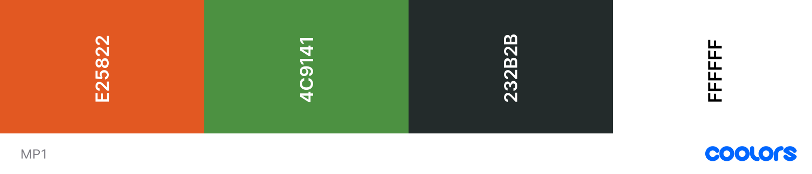

# D'Urban Fitness
## Milestone Project 1 - Kelvin Nicholson

## Table of Contents

### UX
### Technologies Used
### Testing
### Deployment
### Credits

### UX
* #### User Stories
  * First Time User Goals:
    * I want to understand the main purpose of the website and find out about the services offered by the company.
    * I want to be able to easily understand and navigate the website.
    * I want to find testimonials from customers.

  * Returning User Goals:
    * I want to find links to social media accounts for easier future contact or to see what updates the company has.
    * I want to be able to contact the company with a general enquiry or for more information about membership.
    * I want to be able to see membership options without having to contact someone.

* #### Strategy
  * Is to attract new potential customers to the company, to provide them with information of our services and to provide a point of contact. This is to increase awareness and income.

* #### Scope
  * Provide a clean/smooth UX for users.
  * Provide users with essential information as well as the membership options we have.
  * Provide users with testimonials from customers.
  * Provide a clear point of contact.

* #### Structure
  * Existing Features:
    * Four web pages:
      - Home Page - Users can find a brief description about the company and testimonials.
      - About Us Page - Users can find information about the company's history, values and misson.
      - Join Us Page - Users can see the membership options available.
      - Contact Us Page - Users can contact the company through the contact form or find other points of contact.
    * The website is responsive on all devices.
    * User is redirected to Home Page when clicking on the logo.
    * User is able to use the navigation bar at the top of the page to navigate between pages. A "back to top" button will be located at the bottom of every page to prevent the user manually having to scroll back up the page to reach the navigation bar.
    * User can find all social media links and contact information within the footer of every page.
    * User will receive a 404 Page on their screen if they attempt to direct to a page which does not exist.
  * Future Features:
    * Add the ability to schedule an induction session for the gym online.
    * Add a sign up/sign in page for users to be able to store and view infromation about their gym sessions and classes.

* #### Skeleton
  * Wireframes:
    - Mobile: [Home](assets/wireframes/mobile-home.png) | [About Us](assets/wireframes/mobile-about-us.png) | [Our Work](assets/wireframes/mobile-our-work.png) | [Contact Us](assets/wireframes/mobile-contact-us.png)
    - Tablet: [Home](assets/wireframes/tablet-home.png) | [About Us](assets/wireframes/tablet-about-us.png) | [Our Work](assets/wireframes/tablet-our-work.png) | [Contact Us](assets/wireframes/tablet-contact-us.png)
    - Desktop: [Home](assets/wireframes/desktop-home.png) | [About Us](assets/wireframes/desktop-about-us.png) | [Our Work](assets/wireframes/desktop-our-work.png) | [Contact Us](assets/wireframes/desktop-contact-us.png)

* #### Surface 
  * Colour Scheme:
    - 

  * Typography:
    * Two fonts were used throughout this website.
      * Roboto was used for the logo and navigation bar.
      * Lato was used everywhere else throughout the website.

  * Imagery:
    * All hero images on every page is related to gym/fitness. The same general theme/colouring of images is maintained throughout.