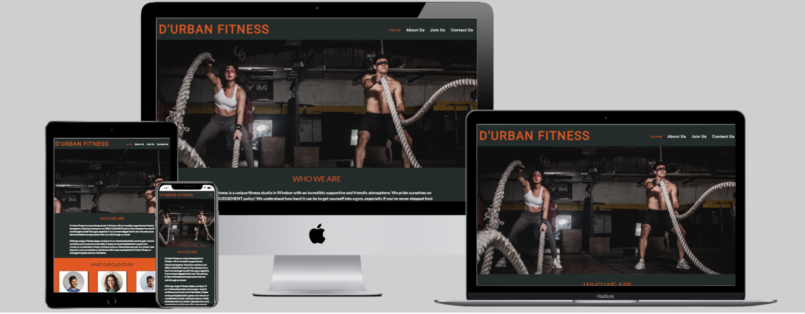
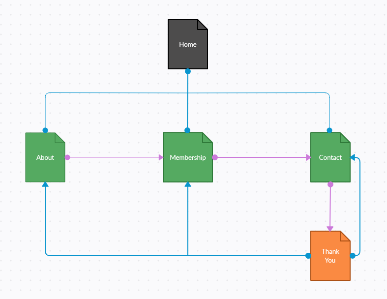
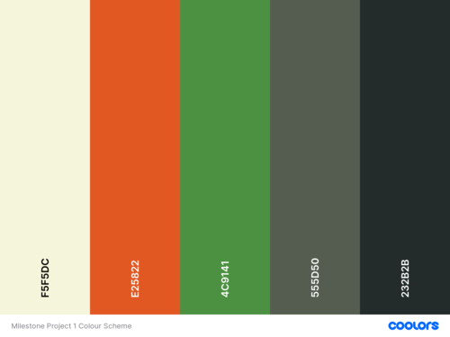
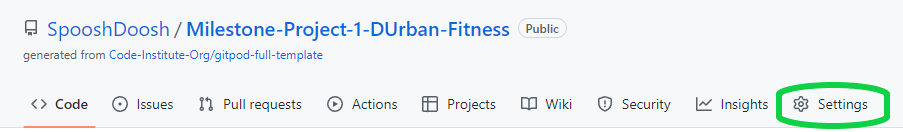
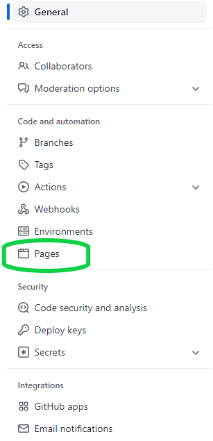
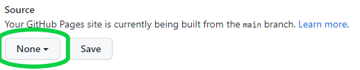
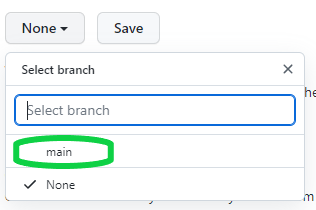
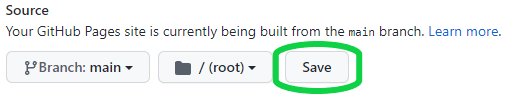
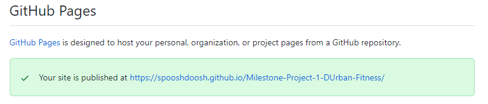
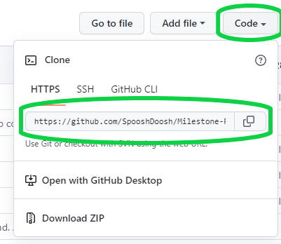

# D'Urban Fitness
# Milestone Project 1 - Kelvin Nicholson

The purpose of this project was to create a multiple page website for a small local gym.

[View live project here](https://spooshdoosh.github.io/Milestone-Project-1-DUrban-Fitness/)
--

---

# Table of Contents

## UX
## Technologies Used
## Testing
## Deployment
## Credits
---

# UX
* ## User Stories
  * First Time User Goals:
    * I want to understand the main purpose of the website and find out about the services offered by the company.
    * I want to be able to easily understand and navigate the website.
    * I want to find testimonials from customers.

  * Returning User Goals:
    * I want to find links to social media accounts for easier future contact or to see what updates the company has.
    * I want to be able to contact the company with a general enquiry or for more information about membership.
    * I want to be able to see membership options without having to contact someone.

  * Site Owner Goals:
    * I want the company to be easily found using search engines.
    * I want to bring attention the who we are and what we do.
    * I want site visitors to the site to be able to easily locate the company as well as the contact details easily from the website.
    * I want site visitors to be able to directly contact the company through the website. 

* ## Strategy
  * Is to attract new potential customers to the company, to provide them with information of our services and to provide a point of contact. This is to increase awareness and income.

* ## Scope
  * Provide a clean/smooth UX for users.
  * Provide users with essential information as well as the membership options we have.
  * Provide users with testimonials from customers.
  * Provide a clear point of contact.

* ## Structure
  * Existing Features:
    * Four web pages:
      - Home Page - Users can find a brief description about the company and testimonials.
      - About Us Page - Users can find information about the company's values and services.
      - Join Us Page - Users can see the membership options available.
      - Contact Us Page - Users can contact the company through the contact form or find other points of contact.
      - Thank You Page - Upon successfully submitting contact form, the user will receive a "Thank you" page acknowledging their enquiry and giving details about response times.
    * The website is responsive on all devices.
    * User can find all social media links and contact information within the footer of every page. Social media links open in new tabs.
    * Users will receive a 404 Page on their screen if they attempt to direct to a page which does not exist.
    * Navigation: 
      * User can land on any page of the website and find what they need within 3 clicks.
      * Navigation bar available on every page and has links to every page (excluding "Thank you" page).
      * About Us page has a button which redirects to the Join Us page.
      * Join Us page has a button beneath each membership option that redirects to the Contact Us page.
      * The Send Enquiry button redirects to a "Thank You" page to confirm form submission. From this page the user can navigate throughout the entire website using the navigation bar.
      * User is redirected to Home Page when clicking on the logo.
      * The buttons move the user through the  website in the order of the pages without skipping pages and without inconveniencing the user.

  * Future Features:
    * Add the ability to schedule an induction session for the gym online.
    * Add links to class timetables and live virtual classes to avoid users having to contact the company for these details.
    * Add gym membership payment functionality to allow users to sign themselves up and pay for membership without having to contact the company.
    * Add a sign in page for users to be able to store and view infromation about their gym sessions, classes and track progress.
    * Potentially create an app for the members to access all of their profile information and possibly communicate with other members and staff.

* ## Skeleton
  * Wireframes:
    - Mobile: [Home](assets/wireframes/index-mobile.png) | [About Us](assets/wireframes/about-mobile.png) | [Join Us](assets/wireframes/join-mobile.png) | [Contact Us](assets/wireframes/contact-mobile.png) | [Thank You](assets/wireframes/submission-mobile.png)
    - Tablet: [Home](assets/wireframes/index-tablet.png) | [About Us](assets/wireframes/about-tablet.png) | [Join Us](assets/wireframes/join-tablet.png) | [Contact Us](assets/wireframes/contact-tablet.png) | [Thank You](assets/wireframes/submission-tablet.png)
    - Desktop: [Home](assets/wireframes/index.png) | [About Us](assets/wireframes/about.png) | [Join Us](assets/wireframes/desktop-our-work.png) | [Contact Us](assets/wireframes/contact.png) | [Thank You](assets/wireframes/submission.png)

  * Sitemap: 
    * Blue lines indicate page access via navigation bar.
    * Purple lines indicate page access via buttons.

    

  * 404 page:
    * User will be redirected to a 404 error page when attempting to access a page that no longer exists or is unavailable. This is the [404 page](404.html).

* ## Surface 
  * Colour Scheme:

    

  * Typography:
    * Two fonts were used throughout this website.
      * Roboto was used for the logo and navigation bar.
      * Lato was used everywhere else throughout the website.

  * Imagery:
    * All images are related to the theme of the website and business. The same general theme/colouring of images is maintained throughout.

---

# Technologies Used
* ## Languages
  * [HTML5](https://en.wikipedia.org/wiki/HTML5) - Used to structure the website.
  * [CSS3](https://en.wikipedia.org/wiki/CSS) - Used to style the content of the website.

* ## Frameworks, Libraries & Programs
  * [Bootstrap](https://getbootstrap.com/) - Used to make the website responsive, and for the design of the navigation bar / hamburger menu.
  * [Font Awesome](https://fontawesome.com/) - Used for the icons throughout the website.
  * [Google Fonts](https://fonts.google.com/) - Used to import the font-families used throughout the website: Roboto and Lato.
  * [Git](https://git-scm.com/) - Used for version control.
  * [GitHub](https://github.com/) - Used to create and host the repository for the website.
  * [Gitpod](https://gitpod.io/) - Integrated Development Environment used to develop the website.
  * [Balsamiq](https://balsamiq.com/) - Used for wireframing of the website.
  * [Coolors](https://coolors.co/) - Used to assemble an appropriate colour palette.
  * [Ezgif](https://ezgif.com/) - Used to convert images to WEBP format and compress images.
  * [Creately](https://app.creately.com/) - Used to create sitemap.

---

# Testing
* Please see [TESTING.md](TESTING.md).

---

# Deployment
This project was deployed to GitHub pages. This project made use of the Code Institute template which can be found [here](https://github.com/Code-Institute-Org/gitpod-full-template).

## GitHub Pages
1. Log in to GitHub and locate this project's [repository](https://github.com/SpooshDoosh/Milestone-Project-1-DUrban-Fitness).
2. Select the "Settings" tab on the repository navigation bar.

3. Select the "Pages" tab on the left hand side menu.

4. Under "Source", select the dropdown labelled "None" and change it to "Main". Select "Save".

5. The page will now refresh automatically and provide a link to the published site.

## Local Deployment
1. Log in to GitHub and locate this project's [repository](https://github.com/SpooshDoosh/Milestone-Project-1-DUrban-Fitness).

2. Select the "Code" dropdown and copy the link provided.

3. You can now paste this link into your IDE terminal.

---

# Credits
* [Pexels](https://www.pexels.com/) - All images throughout the website were sourced from Pexels.
* [Multi Device Website Mockup Generator](https://techsini.com/multi-mockup/) - Used to create the mockup at the top of the README.md file.
* [Bootstrap](https://getbootstrap.com/) - Used for navbar, blockquotes, grid system, forms and all other classes that I used for making the project responsive.
