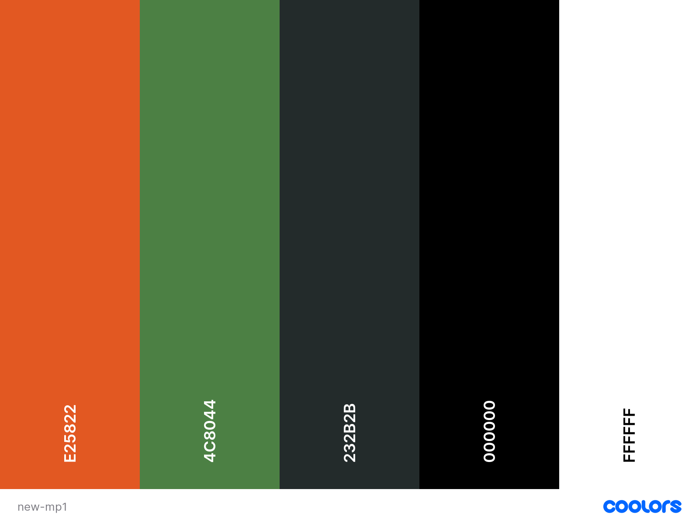

# D'Urban Fitness
# Milestone Project 1 - Kelvin Nicholson

The purpose of this project was to create a multiple page website for a small local gym.

[View live project here](https://spooshdoosh.github.io/Milestone-Project-1-DUrban-Fitness/)
--

---

# Table of Contents

## UX
## Technologies Used
## Testing
## Deployment
## Credits
---

# UX
* ## User Stories
  * First Time User Goals:
    * I want to understand the main purpose of the website and find out about the services offered by the company.
    * I want to be able to easily understand and navigate the website.
    * I want to find testimonials from customers.

  * Returning User Goals:
    * I want to find links to social media accounts for easier future contact or to see what updates the company has.
    * I want to be able to contact the company with a general enquiry or for more information about membership.
    * I want to be able to see membership options without having to contact someone.

* ## Strategy
  * Is to attract new potential customers to the company, to provide them with information of our services and to provide a point of contact. This is to increase awareness and income.

* ## Scope
  * Provide a clean/smooth UX for users.
  * Provide users with essential information as well as the membership options we have.
  * Provide users with testimonials from customers.
  * Provide a clear point of contact.

* ## Structure
  * Existing Features:
    * Four web pages:
      - Home Page - Users can find a brief description about the company and testimonials.
      - About Us Page - Users can find information about the company's values and services.
      - Join Us Page - Users can see the membership options available.
      - Contact Us Page - Users can contact the company through the contact form or find other points of contact.
    * The website is responsive on all devices.
    * User is redirected to Home Page when clicking on the logo.
    * User is able to use the navigation bar at the top of the page to navigate between pages. 
    * User can find all social media links and contact information within the footer of every page.
    * User will receive a 404 Page on their screen if they attempt to direct to a page which does not exist.
  * Future Features:
    * Add the ability to schedule an induction session for the gym online.
    * Add a sign up/sign in page for users to be able to store and view infromation about their gym sessions and classes.

* ## Skeleton
  * Wireframes:
    - Mobile: [Home](assets/wireframes/mobile-home.png) | [About Us](assets/wireframes/mobile-about-us.png) | [Our Work](assets/wireframes/mobile-our-work.png) | [Contact Us](assets/wireframes/mobile-contact-us.png)
    - Tablet: [Home](assets/wireframes/tablet-home.png) | [About Us](assets/wireframes/tablet-about-us.png) | [Our Work](assets/wireframes/tablet-our-work.png) | [Contact Us](assets/wireframes/tablet-contact-us.png)
    - Desktop: [Home](assets/wireframes/desktop-home.png) | [About Us](assets/wireframes/desktop-about-us.png) | [Our Work](assets/wireframes/desktop-our-work.png) | [Contact Us](assets/wireframes/desktop-contact-us.png)

* ## Surface 
  * Colour Scheme:
    - 

  * Typography:
    * Two fonts were used throughout this website.
      * Roboto was used for the logo and navigation bar.
      * Lato was used everywhere else throughout the website.

  * Imagery:
    * All images are related to the theme of the website and business. The same general theme/colouring of images is maintained throughout.

---

# Technologies Used
* ## Languages
  * [HTML5](https://en.wikipedia.org/wiki/HTML5) - Used to structure the website.
  * [CSS3](https://en.wikipedia.org/wiki/CSS) - Used to style the content of the website.

* ## Frameworks, Libraries & Programs
  * [Bootstrap](https://getbootstrap.com/) - Used to make the website responsive, and for the design of the navigation bar / hamburger menu.
  * [Font Awesome](https://fontawesome.com/) - Used for the icons throughout the website.
  * [Google Fonts](https://fonts.google.com/) - Used to import the font-families used throughout the website: Roboto and Lato.
  * [Git](https://git-scm.com/) - Used for version control.
  * [GitHub](https://github.com/) - Used to create and host the repository for the website.
  * [Gitpod](https://gitpod.io/) - Integrated Development Environment used to develop the website.
  * [Balsamiq](https://balsamiq.com/) - Used for wireframing of the website.
  * [Coolors](https://coolors.co/) - Used to assemble an appropriate colour palette.
  * [Ezgif](https://ezgif.com/) - Used to convert images to WEBP format and compress images.

---

# Testing
* Please see [TESTING.md](TESTING.md).

---

# Deployment
This project was deployed to GitHub pages. This project made use of the Code Institute template which can be found [here](https://github.com/Code-Institute-Org/gitpod-full-template).

## GitHub Pages
1. Log in to GitHub and locate this project's [repository](https://github.com/SpooshDoosh/Milestone-Project-1-DUrban-Fitness).
2. Select the "Settings" tab on the repository navigation bar.

3. Select the "Pages" tab on the left hand side menu.

4. Under "Source", select the dropdown labelled "None" and change it to "Main". Select "Save".

5. The page will now refresh automatically and provide a link to the published site.

## Local Deployment
1. Log in to GitHub and locate this project's [repository](https://github.com/SpooshDoosh/Milestone-Project-1-DUrban-Fitness).

2. Select the "Code" dropdown and copy the link provided.

3. You can now paste this link into your IDE terminal.

---

# Credits
* [Pexels](https://www.pexels.com/) - All images throughout the website were sourced from Pexels.
* [Multi Device Website Mockup Generator](https://techsini.com/multi-mockup/) - Used to create the mockup at the top of the README.md file.
* [Bootstrap](https://getbootstrap.com/) - Used for navbar, blockquotes, grid system, forms and all other classes that I used for making the project responsive.
