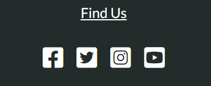

# Testing

# Browser Compatability
This website has been tested and operates as it should on Chrome, Microsoft Edge, Safari, Firefox and Opera browsers.

The website has been tested using Chrome Devloper Tools for it's responsiveness on various device viewports.

It responds as intended on the following devices:
* iPhone XR
* iPhone 12 Pro
* Pixel 5
* Samsung Galaxy S20 Ultra
* iPad Air
* iPAd Mini
* Surface Pro 7
* Surface Duo
* Nest Hub
* Nest Hub Max

I personally tested the website on my iPad 6 and iPhone 12 Pro Max.

---

# User Stories Testing

* I want to understand the main purpose of the website and find out about the services offered by the company.
    * On the homepage there is a brief description of what the website is about as well as a list of what they offer.

    

* I want to be able to easily understand and navigate the website.
    * The navigation throughout the website is the same - simple, straightforward and clear. The active webpage is higlighted in a coloured font.

    

* I want to find testimonials from customers.
    * The homepage has a clear section with testimonials from clients.

    

* I want to find links to social media accounts for easier future contact or to see what updates the company has.
    * Social media links can be found in the footer of every page throughout the website.

    

* I want to be able to contact the company with a general enquiry or for more information about membership.
    * The contact page can be found easily in the navigation bar and contact details can also be found in the footer of every page. The contact form is simple to use. There is a dropdown within the contact form to be able to select the purpose of contact.

    

* I want to be able to see membership options without having to contact someone.
    * On the Join Us page every membership option is listed with price and brief description. There are buttons that link to the contact page should someone wish to do so.

    

---

