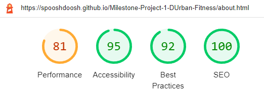
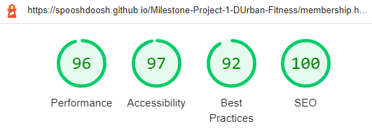

# Testing

# Browser Compatibility
This website has been tested and operates as it should on Chrome, Microsoft Edge, Safari, Firefox and Opera browsers.

The website has been tested using Chrome Devloper Tools for it's responsiveness on various device viewports.

It responds as intended on the following devices:
* iPhone XR
* iPhone 12 Pro
* Pixel 5
* Samsung Galaxy S20 Ultra
* iPad Air
* iPAd Mini
* Surface Pro 7
* Surface Duo
* Nest Hub
* Nest Hub Max

I personally tested the website on my iPad 6 and iPhone 12 Pro Max.

---

# User Stories Testing

* First Time User
    * I want to understand the main purpose of the website and find out about the services offered by the company.
        * On the homepage there is a description of what the website is about as well as a list of what they offer.

        

    * I want to be able to easily understand and navigate the website.
        * The navigation throughout the website is the same - simple, straightforward and clear. The active webpage is higlighted in a coloured font. There also buttons on two pages that will redirect to the appropriate pages.

        

        

        

    * I want to find testimonials from customers.
        * The homepage has a clear section with testimonials from clients.

        

* Returning User
    * I want to find links to social media accounts for easier future contact or to see what updates the company has.
        * Social media links can be found in the footer of every page throughout the website.

        

    * I want to be able to contact the company with a general enquiry or for more information about membership.
        * The contact page can be found easily in the navigation bar and contact details can also be found in the footer of every page. The contact form is simple to use. There is a dropdown within the contact form to be able to select the purpose of contact.

        

    * I want to be able to see membership options without having to contact someone.
        * On the Join Us page every membership option is listed with price and brief description. There are buttons that link to the contact page should someone wish to do so.

        

* Site Owner
    * I want the company to be easily found using search engines.
        * Each webpage has been run through lighthouse which produces a score for Search Engine Optimization. These checks ensure that the page is optimized for search engine results ranking.

        

    * I want to bring attention the who we are and what we do.
        * On the homepage there is a brief description of what the website is about as well as a list of what the company offers.

        

    * I want site visitors to the site to be able to easily locate the company as well as the contact details easily from the website.
        * Contact details for the company can be found on the footer of every webpage. On the Contact Us page there is a map towards the bottom of the page showing the location of the company.

        

        

    * I want site visitors to be able to directly contact the company through the website.

---

# Code Validation

## HTML

Each page of the website was run through the W3C Markup Validation Service to ensure there were no errors. 

* index.html
    * Initially there was an error with a stray div closing tag which has now been resolved. 
    
    

* about.html
     * Initially there was an error with a stray div closing tag which has now been resolved.
    
    

* membership.html
    * Initially there was an error with a stray div closing tag, h2 opening tags had h3 closing tags and one h2 tag had an "s" in it. All of these have now been resolved.
    
    

* contact.html
     * Initially there was an error with a stray div closing tag which has now been resolved.
    
   

* submission.html
    * Initially there was an error with a stray div closing tag which has now been resolved.
    

## CSS

The website's CSS was run through the W3C CSS Validation Service (Jigsaw). No issues or errors were found.

* style.css
    

---

# Lighthouse
Lighthouse was used to test each page (on desktop and mobile versions) to assess performance and overall experience. 

## Desktop Results
* index.html

    

* about.html

    

* membership.html

    

* contact.html

    

     * The Best Practices score is addressed in Debugging.

* submission.html

    

## Mobile Results
* index.html

    

* about.html

    

* membership.html

    

* contact.html

    

* submission.html

    

---

# Debugging
## Resolved
* It had been brought to my attention by a visitor to the site that they could not tell when they had selected the input fields on the form, there was no clear indication to begin typing. To resolve this, the following was done:
    * Removed the inner black border when in focus on the text inputs.
    * Changed the colour of the caret to #fff to conrast the background image.

* Lighthouse mobile performance testing on the "contact us" page was at 75. Changes were made to get the score to 92. To achieve this, the following was done:
   * Replaced mobile background with a WEBP image that had been compressed / optimized.
   * The iframe at the bottom of the page displaying the map was removed from the mobile version of the website.

* When clicking on the "Send Enquiry" button on the form, the user is directed to the Code Institute formdump page. To solve this, a submission.html page was created to notify the user that the enquiry has been sent and to allow them to return to the original website.

## Unresolved 
* Lighthouse mobile performance testing on certain pages is below 90. Lighthouse advises using images that are appropriately sized to save cellular data and improve load times.

* Lighthouse desktop performance testing on the "contact us" page is at 83. This is due to the detection of known security vulnerabilities with front-end JavaScript libraries. Lighthouse advises to ensure Content Security Policy is affective against XSS attacks.
    * Bootstrap vulnerabilities: Cross-site Scripting (XSS)
    * jQuery vulnerabilities: Cross-site Scripting and Prototype Pollution.